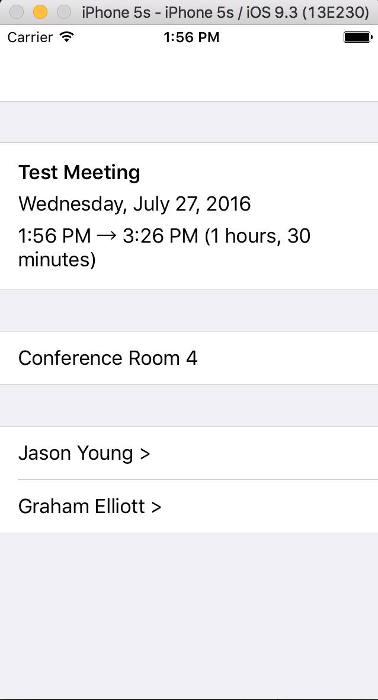

# MeetingSpy
What do you have a lot of? Meetings. What do you do before a meeting with people you haven't met? Look up their titles? Look their background on Linked in? Then this app is for you. After a quick sign-in, your next meeting details will be displayed. No digging through calendar apps. You'll see a list of attendees with all of their details from O365. It also searches LinkedIn for matching profiles, and if there are multiple profiles it uses cognitive services to find the right profile. There are opportunities to tap into other data sources for a 360 degree view of your upcoming meeting. Quick, simple, useful. This is based on proof of concept developed in a few hours.

## Meeting Details

